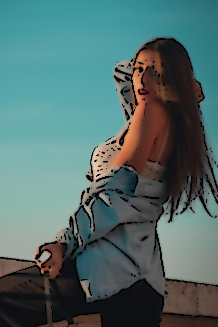

# 카툰 렌더링 테스트 보고서

## 📌 1. 프로젝트 개요

이번 프로젝트의 목표는 다양한 유형의 이미지를 대상으로 **카툰 렌더링 필터**를 적용하고 그 효과를 분석하는 것이다. 
이 필터는 이미지의 윤곽선을 강조하고 색상을 단순화하여 만화 스타일의 효과를 부여한다. 
본 보고서에서는 서로 다른 카테고리의 이미지를 변환한 후 그 결과를 평가한다.

### 개발 환경
- Language: Python 3.13
- Libraries: OpenCV, NumPy
- Platform: Windows (Developed & Tested) / macOS / Linux

### 리소스 출처
**Pixabay** (https://pixabay.com/ko/)

---

## 📌 2. 결과 분석

### ✅ **1) 만화 같은 느낌이 잘 표현된 이미지** 

#### 🎨 **인물 사진** 
- 얼굴의 윤곽선이 선명하게 강조되었으며, 피부의 부드러운 질감이 유지됨.
- 원본보다 단순한 색감이 적용되어 애니메이션 같은 느낌이 강함.
- 머리카락의 경계도 자연스럽게 표현됨.

#### 🏙 **도시 풍경** 
- 건물의 직선적인 윤곽이 강조되면서 카툰 스타일이 잘 적용됨.
- 원본보다 대비가 증가하여 애니메이션 배경과 유사한 느낌이 나타남.

#### 🏞 **자연 풍경**
- 하늘과 산맥의 경계가 뚜렷해지고, 색상이 부드럽게 변환됨.
- 원본보다 일러스트 같은 분위기가 연출됨.

#### 🌃 **야경 사진**
- 네온사인과 불빛이 강조되면서 사이버펑크 스타일의 효과가 나타남.
- 조명의 대비가 증가하여 어두운 배경과 밝은 빛이 뚜렷하게 구별됨.

#### 🏰 **건축물** 
- 구조물의 윤곽선이 강조되면서 건축 도면과 같은 느낌이 강화됨.
- 원본보다 단순화된 색감이 적용되어 현대적인 스타일로 변환됨.

#### 🎭 애니메이션 스타일 이미지
- 엣지 검출이 강하게 적용되었지만, 기존의 윤곽선과 겹쳐지면서 자연스럽게 표현됨.
- 색상이 약간 부드러워지고, 대비가 강화되면서 셀 애니메이션과 비슷한 느낌이 나타남.

---

### ❌ **2) 만화 같은 느낌이 잘 표현되지 않은 이미지** 

#### 🐶 **동물 사진**
- 털이 복잡한 패턴을 가지므로 경계선 검출이 어려움.
- 일부 털이 뭉개지면서 자연스러운 표현이 어려워짐.

#### 🍣 **음식 사진**
- 음식의 질감이 뭉개져서 원본보다 부드러운 느낌이 강함.
- 일부 영역에서는 엣지가 강조되지 않아 선명도가 떨어지는 문제 발생.

#### ♟ **흑백 이미지** 
- 흑백 대비가 강조되긴 했지만, 윤곽선 검출이 너무 강하게 적용됨.
- 원본보다 너무 단순화되면서 일부 디테일이 사라짐.

---

## 📌 3. 한계점

### ⚠ **한계점 1: 세부 텍스처가 많은 경우 표현이 어려움**
- 동물의 털, 음식의 질감, 세밀한 패턴이 있는 경우 경계선이 깨지거나 부자연스럽게 변형됨.
- 대비가 낮은 영역에서는 경계를 인식하기 어려움.

### ⚠ **한계점 2: 색상의 단순화로 인해 정보 손실 가능성**
- 원본 이미지의 색상 대비가 낮을 경우, 엣지가 사라지거나 뭉개지는 문제가 발생함.
- 음식 사진에서 원래의 질감이 사라지고 흐릿한 느낌이 들 수 있음.

### ⚠ **한계점 3: 특정 환경에서 엣지가 과도하게 강조됨**
- 흑백 이미지에서 너무 강한 엣지 필터가 적용되어 자연스러운 표현이 어려움.
- 조명이 강한 경우, 엣지가 필요 이상으로 강조되어 원본보다 왜곡될 가능성이 있음.

---

## 📌 4. 개선 사항

- **엣지 감도 조절 기능 추가** → 윤곽선 검출 강도를 사용자가 조절 가능하도록 개선.
- **색상 유지 옵션 제공** → 원본 색상의 유지 정도를 조정할 수 있도록 필터 설정 추가.
- **세밀한 디테일 보정** → 털, 음식 질감과 같은 세부 요소를 보존하는 필터링 기법 적용.
- **실시간 변환 기능 테스트** → 카메라 피드를 통해 실시간 카툰 렌더링을 구현하는 실험 진행.

---

## 📌 5. 결론

이번 실험을 통해 **카툰 렌더링 필터가 특정 유형의 이미지에서 효과적으로 작동함을 확인**하였다. 
특히, 인물, 건축물, 자연 풍경 등에서는 높은 만족도를 보였으며, 야경 및 흑백 이미지에서도 독창적인 스타일을 제공할 수 있었다. 
반면, 동물 사진, 음식 사진과 같이 **복잡한 텍스처를 포함한 이미지에서는 경계선 표현이 다소 부자연스러울 수 있음을 확인**하였다. 
향후 추가적인 개선을 통해 보다 정교한 카툰 렌더링 필터를 개발할 수 있을 것으로 기대된다.

